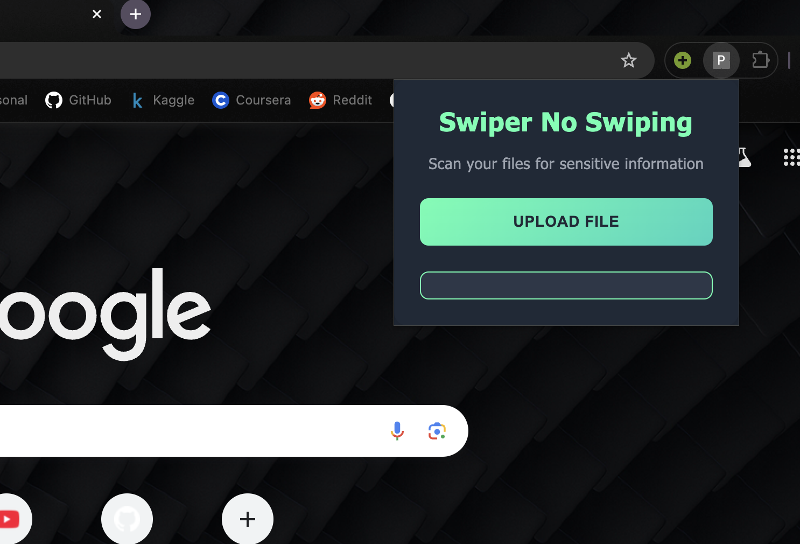
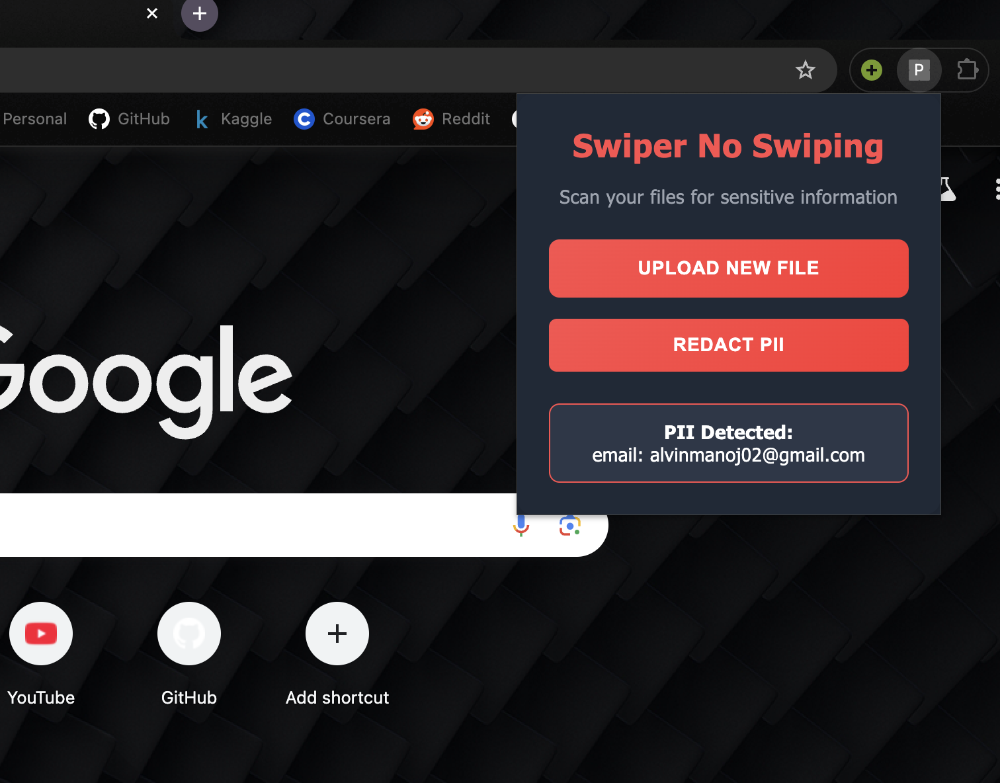

# Swiper-No-Swiping

This is the codebase for the chrome extension for identifying PIIs (Personally Identifiable Information) in sensitive documents before uploading on the web.

## UI of the project

## Extraction of PIIs when a file is uploaded

## How to use this

1. Clone this repo into your working directory.
2. Open chrome and search for "chrome://extensions".
3. Toggle and enable the ***Developer Mode*** on the top right corner of the page.
4. Then click ***Load unpacked*** on the left side of the page, and choose the repo.
5. You will now see the "Swiper-No-Swiping" in your list of extensions.
6. Enable the extension by activating the toggle button of the extension and you are good to go.